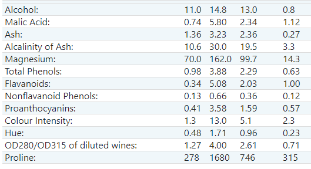
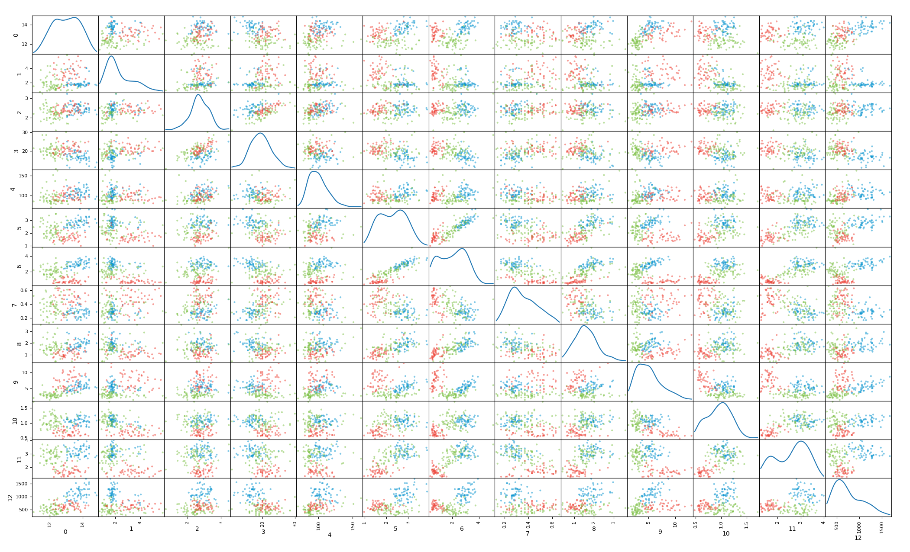
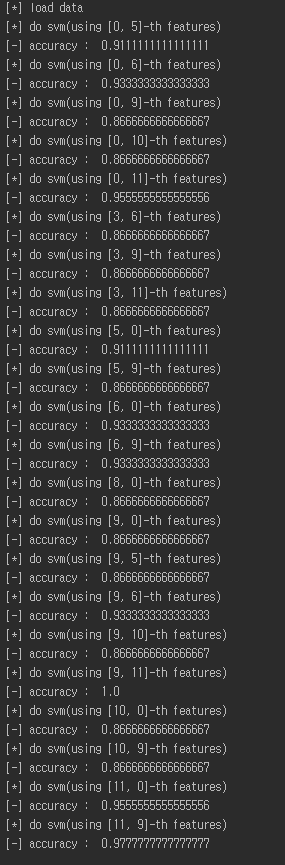
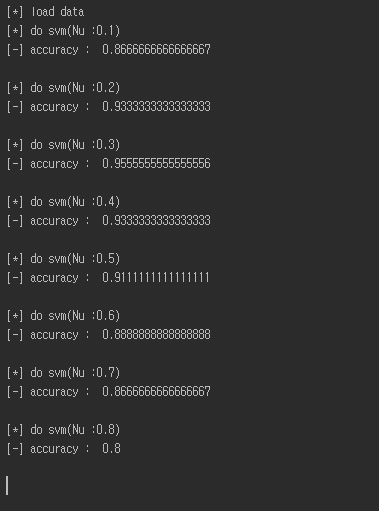
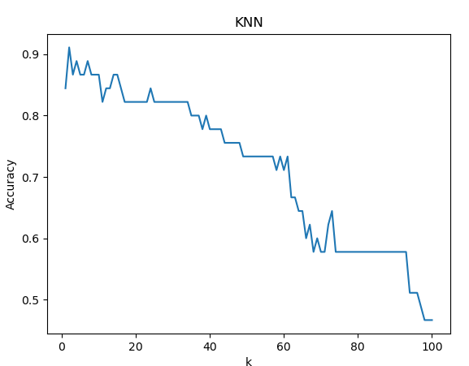
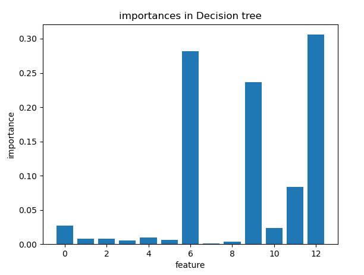

pattern recognition
===============================
using scikit-learn dataset
-------------------

load wine  api dataset을 이용한 패턴 분석 학습 예제
Dataset
---------
Class : 3개
Samples : 178개
Class 1 : 59개
Class 2 : 71개
Class 3 : 48개
Features : 13개

scatter matrix를 이용한 feature 조합 별 산포도
---------------------------------------------------

Linear svm
------------
feature 조합 별 accuracy 결과

Nu Svm
---------
가장 결과가 좋았던 (9,11) feature 조합을 선정하여 수행
Nu parameter의 값을 0.1단위로 증가

파라미터 Nu의 의미는 error를 얼마나 용인할지 비율에 대한 파라미터. 파라미터의 값이 작을수록 복잡한 경계가 만들어지고 클수록 간결한 경계가 만들어진다.
실험 결과의 출력으로 Nu의 값을 0,1 단위로 증가하며 출력해본 결과 0.3에서 가장 높은 accuracy를 갖는 것을 확인할 수 있음.

K-nearest neighbor
---------------------
(9,11) 조합을 그대로 사용
K의 값을 1~100까지 증가시키며 accuracy를 확인

K의 수가 2일 때 가장 높은 결과를 보임. 
이후 underfitting이 발생하면서 점점 결과가 낮아짐.
데이터 셋의 개수가 적은 것을 고려하면 당연한 결과라고 생각함. 

Decision Tree Classifier
-------------------------

